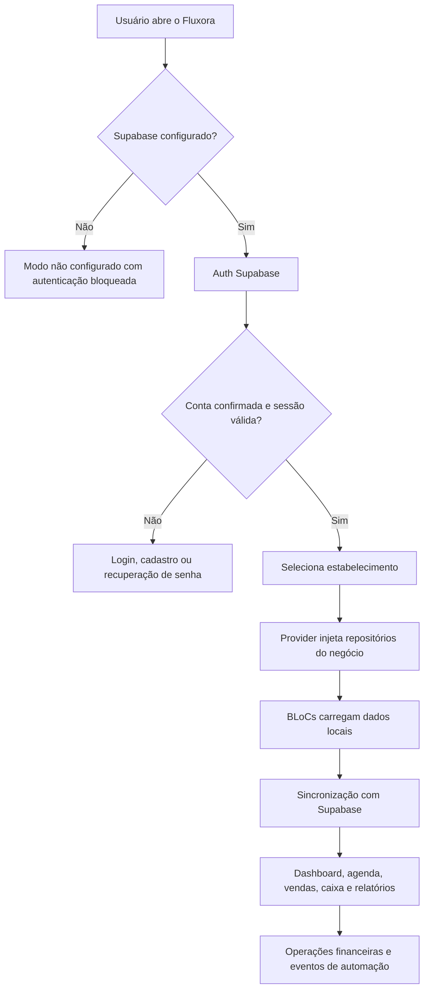

# Fluxora

Gestão financeira e operacional para negócios de beleza e bem-estar.
Controle vendas, comissões, caixa, agenda, produtos e lucro real em uma experiência Flutter multiplataforma.

---

## Badges


---

## Imagem Principal

> Placeholder para a tela principal do app.


---

## Sobre O Projeto

O Fluxora resolve uma dor comum em pequenos negócios de beleza: faturar não significa lucrar. O app organiza atendimentos, vendas, comissões, taxas, despesas, retiradas e caixa para responder uma pergunta central: **quanto realmente sobrou para o estabelecimento?**

O público-alvo da V1 são barbearias, salões, esmalterias, manicures/pedicures, spas, estúdios de cílios/sobrancelhas, maquiadores e clínicas de estética não médicas com 1 a 15 profissionais.

O diferencial competitivo está no foco financeiro real. Agenda, produtos, profissionais e clientes existem para alimentar um núcleo de cálculo de lucro líquido, margem, repasses e disponibilidade de caixa.

---

## Principais Funcionalidades

### Financeiro

| Recurso | Descrição |
| --- | --- |
| Dashboard de resultado | Mostra faturamento, comissões, despesas, taxas, retiradas, lucro e margem. |
| Lançamentos financeiros | Registra entradas, despesas operacionais, impostos, retiradas e receitas extras. |
| Cálculo de lucro real | Considera taxas de pagamento, comissões, custos de produtos, despesas e retiradas. |
| Relatórios por período | Consolida desempenho por intervalo, serviço e profissional. |

### Agenda

| Recurso | Descrição |
| --- | --- |
| Agenda interna | Organiza atendimentos do estabelecimento. |
| Agenda por profissional | Configura serviços, expediente, intervalos e bloqueios individuais. |
| Busca pública | Lista estabelecimentos por nome, serviço, cidade, estado ou CEP sem exigir login do cliente. |
| Portal público | Permite agendamento via link web direto do estabelecimento. |
| Proteção contra duplicidade | Usa idempotência e validação no Supabase para evitar reservas repetidas. |

### Profissionais

| Recurso | Descrição |
| --- | --- |
| Cadastro de equipe | Registra profissionais vinculados ao estabelecimento. |
| Comissão por serviço | Calcula repasses conforme regras associadas aos atendimentos. |
| Acesso limitado | Profissional visualiza apenas agenda e operação permitidas ao seu papel. |

### Clientes

| Recurso | Descrição |
| --- | --- |
| Cadastro de clientes | Mantém dados operacionais por estabelecimento. |
| Fidelidade por níveis | Configuração por negócio com níveis `new`, `standard`, `gold` e `premium`. |
| Associação manual segura | Permite corrigir identidade de cliente fiel antes do checkout, com auditoria. |
| Agendamento sem app | Cliente agenda pelo navegador informando nome, e-mail e telefone. |

### Produtos

| Recurso | Descrição |
| --- | --- |
| Produtos por nicho | Catálogo respeita o tipo de estabelecimento selecionado. |
| Venda no checkout | Produtos podem ser adicionados ao finalizar atendimento. |
| Baixa de estoque | Checkout registra movimentos e reduz estoque no Supabase. |
| Visão protegida | Funcionário consulta produtos vendáveis sem visualizar custo interno. |

### Conta

| Recurso | Descrição |
| --- | --- |
| Autenticação Supabase | Login, cadastro, confirmação de e-mail e recuperação de senha. |
| Deep links seguros | Fluxos de confirmação e recuperação separados para app e web. |
| Exportação de dados | Tela de configurações expõe exportação em JSON. |
| Exclusão de conta | Edge Function dedicada para remoção de conta e dados associados. |

### Assinaturas

| Recurso | Descrição |
| --- | --- |
| Trial de 14 dias | Controle de período gratuito por estabelecimento. |
| Google Play Billing | Integração preparada com `in_app_purchase`. |
| Plano fundador | Produto planejado `fluxora_pro` com plano mensal `mensal`. |

---

## Arquitetura

O Fluxora usa uma arquitetura em camadas com contratos de domínio, repositórios substituíveis e estado previsível por BLoC.

```text
lib/
  app/
    fluxora_app.dart       # composição do app, rotas, tema e providers globais
    theme.dart             # identidade visual Material 3
  data/
    local_*                # persistência local com SharedPreferences
    offline_first_*        # composição local + remoto + fila de sincronização
    supabase_*             # integração Supabase por domínio
    google_play_*          # integração com Google Play Billing
  domain/
    *_repository.dart      # contratos de infraestrutura
    *.dart                 # entidades e regras de negócio puras
  l10n/
    supported_locales.dart # locales preparados para expansão internacional
  state/
    *_bloc.dart            # orquestra eventos e regras
    *_event.dart           # comandos do usuário/sistema
    *_state.dart           # estados imutáveis para a UI
  ui/
    *_page.dart            # telas, navegação e composição visual
```

### Responsabilidades

| Camada | Responsabilidade |
| --- | --- |
| `domain` | Modelos, contratos e regras independentes de UI/banco. |
| `data` | Implementações locais, remotas e offline-first. |
| `state` | BLoCs que recebem eventos, executam casos de uso e emitem estados. |
| `ui` | Telas Material 3 que apenas leem estado e disparam eventos. |
| `app` | Inicialização, tema, rotas, localização e injeção de dependências. |

### Por Que BLoC?

BLoC foi escolhido porque os fluxos do Fluxora têm regras sensíveis: dinheiro, comissão, caixa, permissões, assinaturas, agenda e autenticação. Separar eventos, estados e efeitos deixa o comportamento testável e reduz acoplamento entre interface e regra de negócio.

### Como Provider É Usado?

Provider fica restrito à injeção de dependências. Ele entrega contratos como `FinanceRepository`, `BillingRepository`, `PublicBookingRepository` e `AccountLifecycleRepository`, sem competir com o BLoC pelo controle de estado.

### Offline First

Os repositórios `OfflineFirst*` combinam:

| Parte | Função |
| --- | --- |
| Local | Salva dados em `SharedPreferences` para manter o app utilizável sem rede. |
| Remoto | Sincroniza com Supabase quando a conexão está disponível. |
| Fila | Guarda operações pendentes e tenta reenviar antes de buscar dados novos. |
| Merge | Une dados remotos com alterações locais ainda pendentes. |

### Desacoplamento Por Interfaces

A UI e os BLoCs dependem de contratos em `domain/`, não de Supabase diretamente. Isso permite testar regras com repositórios fake, trocar infraestrutura e manter o domínio financeiro isolado da camada de armazenamento.

---

## Tecnologias

| Tecnologia | Finalidade |
| --- | --- |
| Flutter | App multiplataforma para Android, iOS, Web e Windows. |
| Dart | Linguagem principal do projeto. |
| Material 3 | Sistema visual, temas claro/escuro e componentes modernos. |
| BLoC | Estado previsível por eventos e estados imutáveis. |
| Provider | Injeção de dependências. |
| Supabase | Auth, banco PostgreSQL, RLS, RPCs e Edge Functions. |
| SharedPreferences | Persistência local e filas simples de sincronização. |
| In App Purchase | Preparação para assinaturas via Google Play Billing. |
| App Links | Deep links de confirmação e recuperação de senha. |
| GitHub Actions | Pipeline de análise, testes e deploy web. |
| GitHub Pages | Hospedagem inicial do portal público de agendamento e do painel web administrativo. |

---

## Fluxo Da Aplicação



---

## Offline First

O Fluxora foi desenhado para não depender de rede em tarefas operacionais críticas. Os repositórios locais salvam dados por estabelecimento em `SharedPreferences`, e os repositórios offline-first tentam sincronizar com o Supabase quando possível.

Quando uma operação remota falha, ela é gravada em uma fila local por `businessId`. Na próxima leitura, o app tenta esvaziar essa fila antes de mesclar dados locais e remotos. Essa estratégia evita perda de lançamentos e reduz atrito para negócios que usam o app em balcão, salão ou atendimento com conexão instável.

O Supabase continua sendo a autoridade para regras sensíveis: permissões, fidelidade, checkout, baixa de estoque, criação de vendas, associação de clientes e proteção contra agendamentos simultâneos.

---

## Segurança

| Área | Implementação |
| --- | --- |
| Autenticação | Supabase Auth com e-mail/senha, confirmação de conta e recuperação de senha. |
| Deep links | URLs separadas para confirmação de e-mail e recuperação de senha no app/web. |
| Isolamento por negócio | Dados operacionais carregam `businessId` e políticas RLS no Supabase. |
| Perfis de acesso | Dono, gestor e profissional possuem permissões distintas. |
| Cliente público | Portal não expõe descontos nem níveis de fidelidade ao cliente. |
| Checkout | Regras financeiras sensíveis são validadas por RPCs no banco. |
| Exclusão de conta | Edge Function `delete-account` remove conta autenticada. |
| Exportação | Configurações oferecem exportação dos dados do usuário em JSON. |
| Segredos | App usa `SUPABASE_URL` e `SUPABASE_PUBLISHABLE_KEY`; `service_role` não entra no cliente. |

---

## Estrutura De Pastas

```text
.
  .github/workflows/        # CI Flutter e deploy do portal web
  android/                  # projeto Android
  assets/
    branding/               # artefatos de marca
    startup/                # splash DevVoid
  docs/                     # arquitetura, escopo, Supabase, roadmap e Play Store
  ios/                      # projeto iOS
  lib/
    app/                    # composição do app
    data/                   # repositórios e integrações
    domain/                 # entidades e contratos
    l10n/                   # locales suportados
    state/                  # BLoCs, eventos e estados
    ui/                     # telas e componentes
    main.dart               # bootstrap e wiring de dependências
  scripts/                  # automações de build
  supabase/
    functions/              # Edge Functions
    migrations/             # schema, RLS, RPCs e automações
  test/                     # testes unitários e de widget
  web/                      # artefatos web e páginas legais
  windows/                  # projeto Windows
```

---

## Como Executar

### Pré-Requisitos

| Ferramenta | Uso |
| --- | --- |
| Flutter stable | Build e execução do app. |
| Dart SDK | Incluído no Flutter. |
| Git | Clonar e versionar o projeto. |
| Supabase project | Necessário para autenticação e dados remotos. |

### Clone

```powershell
git clone https://github.com/TerribleGeorge/Fluxora.git
cd Fluxora
```

### Instalação

```powershell
flutter pub get
```

### Variáveis De Ambiente

O app não possui chaves fixas no código. Passe as variáveis com `--dart-define`:

```powershell
flutter run `
  --dart-define=SUPABASE_URL=https://SEU-PROJETO.supabase.co `
  --dart-define=SUPABASE_PUBLISHABLE_KEY=SUA_CHAVE_PUBLICAVEL `
  --dart-define=AUTH_WEB_REDIRECT_BASE_URL=https://SEU-DOMINIO/ `
  --dart-define=PUBLIC_BOOKING_BASE_URL=https://SEU-DOMINIO
```

| Variável | Obrigatória | Descrição |
| --- | --- | --- |
| `SUPABASE_URL` | Sim | URL do projeto Supabase. |
| `SUPABASE_PUBLISHABLE_KEY` | Sim | Chave pública/anon para cliente Flutter. |
| `AUTH_WEB_REDIRECT_BASE_URL` | Recomendado | Base usada por confirmação de conta e recuperação de senha na web. |
| `PUBLIC_BOOKING_BASE_URL` | Recomendado em release | Base do portal público compartilhado pelo app. |

Sem `SUPABASE_URL` e `SUPABASE_PUBLISHABLE_KEY`, o Fluxora abre em modo não configurado e bloqueia autenticação real.

### Configuração Supabase

No painel do Supabase, configure:

```text
Site URL:
https://terriblegeorge.github.io/fluxora-admin/

Redirect URLs:
dev.devvoid.fluxora://reset-password
dev.devvoid.fluxora://auth-confirmation
https://terriblegeorge.github.io/fluxora-admin/?auth-action=password-recovery
https://terriblegeorge.github.io/fluxora-admin/?auth-action=email-confirmation
https://terriblegeorge.github.io/fluxora-agendamento/?auth-action=password-recovery
https://terriblegeorge.github.io/fluxora-agendamento/?auth-action=email-confirmation
```

Também é necessário habilitar e-mail/senha, confirmação de e-mail e SMTP próprio antes de convidar usuários externos.

### URLs Publicadas

| Público | URL | Finalidade |
| --- | --- | --- |
| Dono/admin | https://terriblegeorge.github.io/fluxora-admin/ | Acesso web ao painel administrativo do estabelecimento. |
| Cliente | https://terriblegeorge.github.io/fluxora-agendamento/ | Busca pública de estabelecimentos e agendamento sem login. |

### Release Android

```powershell
.\scripts\build_play_release.ps1
```

---

## Testes

### Comandos

```powershell
flutter analyze --no-pub
flutter test --no-pub
```

### Cobertura Existente

| Grupo | Exemplos |
| --- | --- |
| Domínio financeiro | `finance_bloc_test.dart`, `business_metrics_test.dart`, `local_finance_repository_test.dart` |
| Agenda | `appointment_bloc_test.dart`, `appointment_availability_test.dart`, `local_appointment_repository_test.dart` |
| Autenticação | `auth_bloc_test.dart`, `auth_redirect_configuration_test.dart`, `password_recovery_page_test.dart` |
| Conta e permissões | `account_domain_test.dart`, `business_bloc_test.dart` |
| Catálogo e serviços | `catalog_bloc_test.dart`, `service_template_test.dart` |
| Produtos e checkout | `product_customer_bloc_test.dart`, `loyalty_product_checkout_test.dart` |
| Portal público | `public_booking_directory_page_test.dart`, `public_booking_page_test.dart`, `public_booking_route_test.dart`, `supabase_public_booking_repository_test.dart` |
| Assinaturas | `subscription_test.dart` |
| Internacionalização | `internationalization_test.dart` |

O workflow `.github/workflows/flutter.yml` executa análise e testes em push e pull request para `main`.

---

## Roadmap

Roadmap baseado em `docs/ROADMAP.md`.

| Status | Item |
| --- | --- |
| Concluído | Posicionamento, público e escopo da V1. |
| Concluído | Arquitetura de usuários, negócios e permissões. |
| Concluído | Autenticação e recuperação de acesso. |
| Código concluído; implantação externa pendente | Banco em nuvem e sincronização local. |
| Concluído | Cadastro de profissionais e serviços. |
| Concluído | Atendimentos, vendas e formas de pagamento. |
| Concluído | Comissões, repasses e fechamento de caixa. |
| Concluído | Despesas, taxas e retirada do proprietário. |
| Concluído | Dashboard de lucro e relatórios. |
| Concluído | Onboarding, planos e período de teste. |
| Código concluído; validação remota pendente | Agenda interna e acesso limitado do profissional. |
| Código e hospedagem concluídos; implantação Supabase pendente | Página pública de agendamento para clientes. |
| Código concluído; implantação Supabase pendente | Vitrine pública por localidade e CEP. |
| Código concluído; provedor de destino pendente | Eventos para automações externas. |
| Planejado | Integração n8n + WhatsApp. |
| Planejado | Painel web para uso no PC. |
| Bloqueado por contas externas | Testes, beta fechado e publicação. |

---

## Capturas De Tela

| Tela | Placeholder |
| --- | --- |
| Dashboard | `docs/images/dashboard.png` |
| Financeiro | `docs/images/financeiro.png` |
| Agenda | `docs/images/agenda.png` |
| Cadastro | `docs/images/cadastro.png` |
| Relatórios | `docs/images/relatorios.png` |

---

## Documentação

| Documento | Conteúdo |
| --- | --- |
| `docs/ARCHITECTURE.md` | Decisões de arquitetura, estado, dados e regras sensíveis. |
| `docs/PRODUCT_SCOPE_V1.md` | Escopo comercial da primeira versão. |
| `docs/ACCOUNT_ARCHITECTURE.md` | Usuários, estabelecimentos e permissões. |
| `docs/BEAUTY_BUSINESS_RULES.md` | Regras de fidelidade, checkout, produtos e segurança. |
| `docs/PUBLIC_BOOKING.md` | Portal público de agendamento e validação. |
| `docs/SUPABASE_SETUP.md` | Configuração de Auth, redirects e build. |
| `docs/MONETIZATION_STRATEGY.md` | Estratégia de assinatura e Play Billing. |
| `docs/INTERNATIONALIZATION.md` | Preparação para expansão internacional. |
| `docs/RELEASE_CHECKLIST.md` | Pendências externas para publicação. |

---

## Contribuição

Contribuições são bem-vindas quando mantêm o foco do produto: gestão financeira real para beleza e bem-estar.

```powershell
git checkout -b feature/minha-melhoria
flutter analyze --no-pub
flutter test --no-pub
git commit -m "Describe the improvement"
git push origin feature/minha-melhoria
```

Antes de abrir um pull request:

| Checklist | Critério |
| --- | --- |
| Escopo | A mudança pertence ao ramo de beleza e bem-estar. |
| Arquitetura | UI não acessa Supabase diretamente quando houver contrato em `domain`. |
| Estado | Regras novas passam por BLoC ou domínio testável. |
| Segurança | Dados financeiros e permissões não dependem apenas da interface. |
| Testes | Fluxos críticos têm teste unitário ou de widget. |

---

## Licença

Nenhuma licença foi especificada neste repositório até o momento.

---

## Autor

**TerribleGeorge**
DevVoid.dev
GitHub: [@TerribleGeorge](https://github.com/TerribleGeorge)
